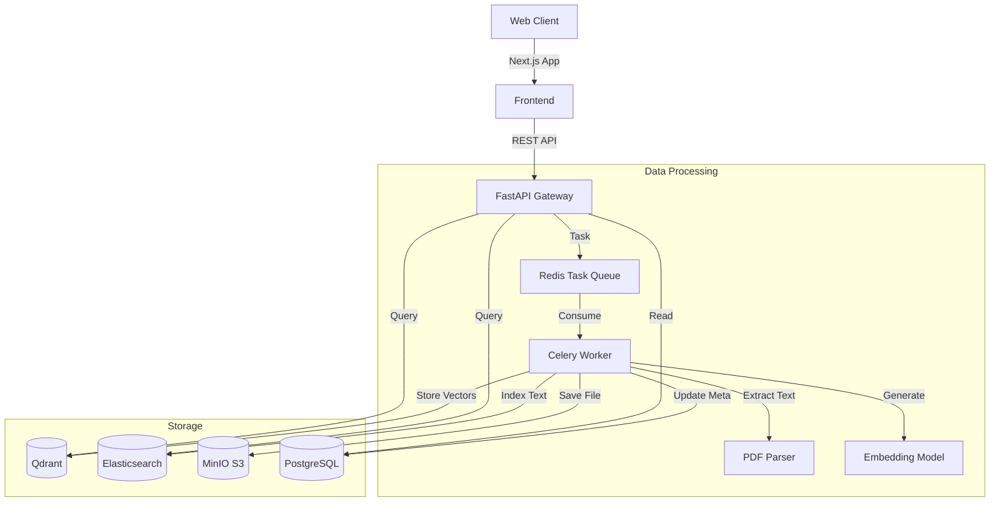

# Research Intelligence Platform (Enterprise Edition)

[](https://www.python.org/)
[](https://fastapi.tiangolo.com/)
[](https://nextjs.org/)
[](https://www.postgresql.org/)
[](https://www.docker.com/)

An enterprise-grade research intelligence platform that transforms unstructured documents into actionable insights. Powered by **Hybrid Semantic Search**, it combines vector embeddings (Qdrant) with keyword search (Elasticsearch) to deliver precise results from thousands of PDFs, reports, and financial statements.

---

## 🚀 Key Features

### 🧠 Intelligent Search
- **Hybrid Search Engine**: Fuses vector proximity (semantic meaning) with keyword matching (exact terms) using Reciprocal Rank Fusion (RRF).
- **Deep Semantic Understanding**: Uses `sentence-transformers/all-MiniLM-L6-v2` for state-of-the-art embedding generation.
- **Smart Filtering**: Drill down by company entity, document type, or date range.

### 💼 Corporate UI / UX
- **Professional Design System**: A "Deep Navy & Vibrant Blue" aesthetic tailored for financial and research environments.
- **Glassmorphism Interface**: Modern, sticky headers and tactile interactive elements.
- **Data-Grid Repository**: Enterprise-class document management view with status badges and metadata analysis.

### ⚡ Robust Architecture
- **Asynchronous Processing**: Celery + Redis pipeline for non-blocking document ingestion.
- **Scalable Storage**: MinIO (S3-compatible) for object storage and PostgreSQL for structured metadata.
- **Fault Tolerance**: Comprehensive error handling and retry mechanisms.

---

## 🏗️ Architecture



---

## 🛠️ Quick Start

### Prerequisites
- Docker & Docker Compose
- Python 3.11+
- Node.js 18+

### 1. Launch Infrastructure
Start the database, vector store, and object storage services:
```bash
docker-compose up -d
```
*Note: Wait ~30 seconds for all services to become healthy.*

### 2. Backend Setup
```bash
cd backend
python -m venv venv
# Windows:
venv\Scripts\activate
# Mac/Linux:
# source venv/bin/activate

pip install -r requirements.txt
python main.py
```
*API available at `http://localhost:8000`*

### 3. Frontend Setup
```bash
cd frontend
npm install
npm run dev
```
*UI available at `http://localhost:3000`*

---

## 🧪 Demo Mode (No Docker Required)

Want to try the UI without setting up the full database stack?
You can run the backend in **Demo Mode**, which uses in-memory storage.

```bash
# In backend directory
python demo_main.py
```
*Note: Uploaded documents will not persist after server restart in demo mode.*

---

## 📚 API Documentation

Once the backend is running, access the interactive Swagger UI:
- **Docs**: [http://localhost:8000/docs](http://localhost:8000/docs)
- **ReDoc**: [http://localhost:8000/redoc](http://localhost:8000/redoc)

### Core Endpoints
- `POST /api/upload`: Asynchronous PDF ingestion.
- `POST /api/search`: Hybrid search query with filters.
- `GET /api/documents`: List managed documents.

---

## 🔮 Roadmap

- [x] **Phase 1: MVP & Core Search** (Completed)
- [x] **Phase 1.5: Corporate UI Redesign** (Completed)
- [ ] **Phase 2: Advanced Analytics** (Time-series data, Entity linking)
- [ ] **Phase 3: Multi-User Collaboration** (Shared workspaces, annotations)

---

## 📄 License

MIT © 2026 Research Platform Team
